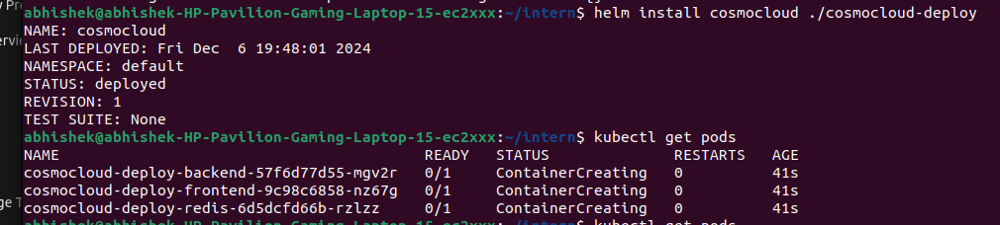
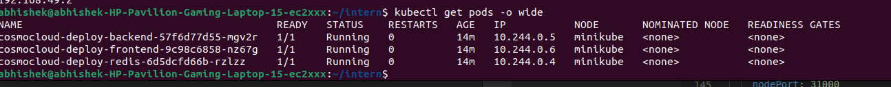
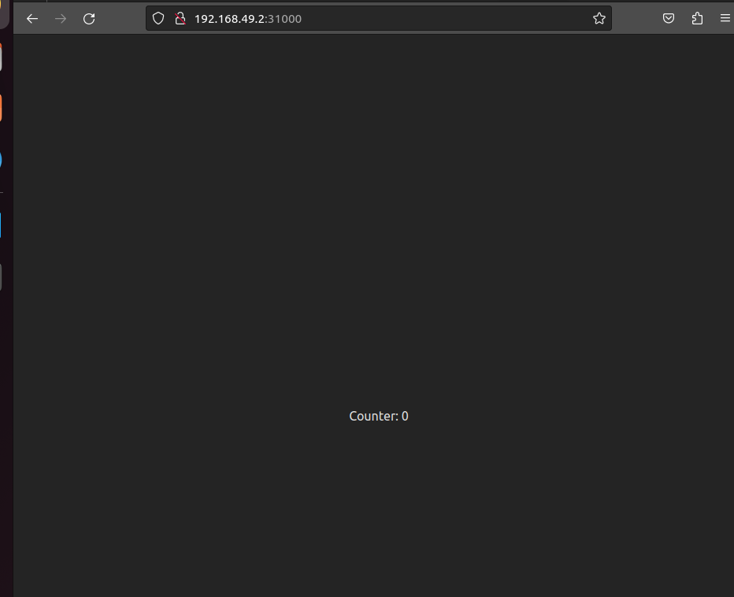

# Helm Deployment for Cosmocloud

This repository demonstrates how to deploy the Cosmocloud application using Helm on a Minikube-based Kubernetes cluster. The deployment includes backend, frontend, and Redis services.

## Prerequisites

Before you begin, ensure that you have the following tools installed:

- **Minikube**: A local Kubernetes environment for testing purposes.
- **Helm**: A package manager for Kubernetes to manage applications.
- **kubectl**: Kubernetes command-line tool to interact with your Kubernetes cluster.

### Install Minikube, Helm, and kubectl

#### Install Minikube
Follow the official Minikube installation guide: [Install Minikube](https://minikube.sigs.k8s.io/docs/installation/)

#### Install Helm
Follow the official Helm installation guide: [Install Helm](https://helm.sh/docs/intro/install/)

#### Install kubectl
Follow the official kubectl installation guide: [Install kubectl](https://kubernetes.io/docs/tasks/tools/install-kubectl/)

## Setup Instructions

### 1. Start Minikube

Run Minikube to start your local Kubernetes cluster:

```bash
minikube start
```

This will start a Kubernetes cluster on your local machine.

### 2. Deploy the Cosmocloud Application using Helm

#### Clone the Repository

Clone this repository to your local machine:

```bash
git clone <your-repository-url>
cd <your-cloned-directory>
```

#### Install Helm Chart

Once you've cloned the repository and navigated to the Helm chart folder, you can install the Cosmocloud chart:

```bash
helm install cosmocloud ./cosmocloud-deploy
```

This command deploys the Cosmocloud application, which consists of the backend, frontend, and Redis components using Kubernetes resources like Deployments and Services.

### 3. Verify Deployment

After running the `helm install` command, check that your services and pods are running:

```bash
kubectl get pods
```

This command will list the running pods. You should see the pods for `backend`, `frontend`, and `redis`.

To check if the services are properly exposed, run:

```bash
kubectl get svc
```

Ensure that the `frontend-svc` is exposed via `NodePort`.

### 4. Access the Frontend

You can access the frontend service in two ways:

#### Method 1: Access via Minikube IP

Minikube provides an internal IP address to access the services. Run the following command to get the Minikube IP:

```bash
minikube ip
```

For example, if Minikube IP is `192.168.49.2`, you can access the frontend service via:

```
http://192.168.49.2:31000
```

#### Method 2: Access via kubectl Port-Forward

Alternatively, you can forward the `frontend-svc` port to your local machine:

```bash
kubectl port-forward svc/frontend-svc 8000:5173
```

This will forward the `frontend-svc`'s port `5173` to `8000` on your local machine. Access the frontend service at:

```
http://localhost:8000
```

### 5. Troubleshooting

If the frontend keeps loading or is inaccessible, try the following:

1. **Verify the Service Status**: Check if the `frontend-svc` service is up and running:

    ```bash
    kubectl get svc frontend-svc
    ```

    Ensure the `EXTERNAL-IP` is populated, or use the Minikube IP to access the service.

2. **Check Pod Logs**: If the frontend is still not accessible, check the pod logs:

    ```bash
    kubectl logs <frontend-pod-name>
    ```

3. **Port Forwarding**: If `EXTERNAL-IP` is not available, use `kubectl port-forward` to forward traffic from the service to your local machine.

### 6. Clean Up

To uninstall the deployed application and remove all associated resources, run:

```bash
helm uninstall cosmocloud
```

This will remove all Kubernetes resources deployed by the Helm chart.

## Conclusion
successfully deployed the Cosmocloud application on a local Minikube Kubernetes cluster using Helm.


## Problems
Frontend not able to access backend due to cors error need fix in backend code


## Tested Screenshots

1. helm install



2. Pods



3. frontend 

